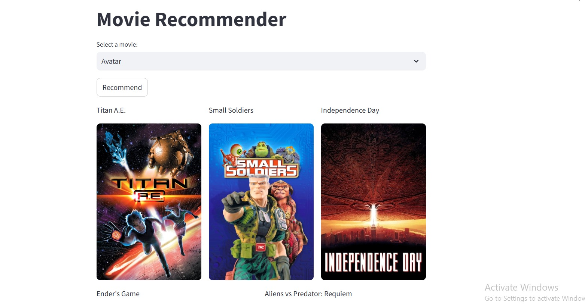

# Movie Recommendation App

## Overview
The **Movie Recommendation App** is a machine learning-based web application that suggests movies based on user preferences. This project utilizes content-based filtering to recommend similar movies based on a selected movie title. The app is built using **Python, Streamlit, Pandas, and Scikit-learn**.

## Features
- Recommend similar movies based on a selected title
- User-friendly interface built with **Streamlit**
- Uses **TF-IDF Vectorization** and **Cosine Similarity** for recommendations
- Lightweight and easy to deploy

## Tech Stack
- **Frontend:** Streamlit
- **Backend:** Python
- **Libraries Used:** Pandas, NumPy, Scikit-learn, Streamlit, Requests

## Installation & Setup
1. Clone the repository:
   ```sh
   git clone https://github.com/vshnvii/movie-recommendation-app.git
   cd movie-recommendation-app
   ```
2. Create a virtual environment (optional but recommended):
   ```sh
   python -m venv venv
   source venv/bin/activate  # On macOS/Linux
   venv\Scripts\activate     # On Windows
   ```
3. Install dependencies:
   ```sh
   pip install -r requirements.txt
   ```
4. Run the application:
   ```sh
   streamlit run app.py
   ```

## Usage
1. Open the app in your browser.
2. Enter or select a movie title from the list.
3. Click the "Recommend" button to get a list of similar movies.
4. Explore the recommended movies and enjoy!

## 📸 App Preview


## Dataset
The dataset used in this project is sourced from **TMDb** and preprocessed for better recommendations. It includes movie titles, genres, descriptions, and other metadata.

## Must See
TMDb in india has been banned by Jio, so make sure to use/open the app on any other network except Jio.

## Future Improvements
- Add collaborative filtering for better recommendations
- Integrate a movie trailer preview feature
- Deploy the app on **Heroku or Streamlit Sharing**


